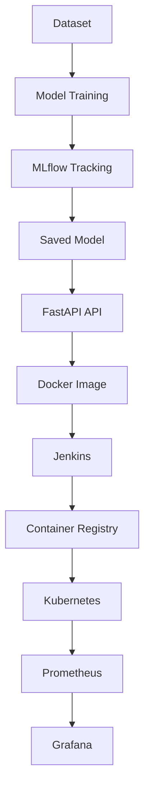
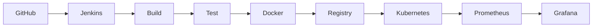

# ❤️ End-to-End MLOps Pipeline -- Heart Disease Prediction


> A production-ready **End-to-End MLOps Pipeline** for Heart Disease
> Prediction using **Scikit-Learn, FastAPI, MLflow, Docker, Kubernetes,
> Jenkins, Prometheus, and Grafana**.

------------------------------------------------------------------------

# 📑 Table of Contents

-   Project Overview
-   Features
-   Architecture
-   Technology Stack
-   Project Structure
-   Workflow
-   Getting Started
-   Model Training
-   Running the API
-   Docker
-   Kubernetes
-   Jenkins CI/CD
-   Monitoring
-   API Endpoints
-   Screenshots
-   Model Performance
-   Future Improvements
-   Contributing
-   License
-   Author

------------------------------------------------------------------------

# 🎯 Project Overview

This project demonstrates a complete MLOps workflow from model training
to production deployment.

It includes: - Machine Learning model training - MLflow experiment
tracking - FastAPI REST API - Docker containerization - Kubernetes
deployment - Jenkins CI/CD - Prometheus monitoring - Grafana
dashboards - Swagger UI

------------------------------------------------------------------------

# ✨ Features

  Feature                    Status
  -------------------------- --------
  Heart Disease Prediction   ✅
  MLflow Model Tracking      ✅
  FastAPI REST API           ✅
  Docker Support             ✅
  Kubernetes Deployment      ✅
  Jenkins CI/CD              ✅
  Prometheus Metrics         ✅
  Grafana Dashboard          ✅
  Health Checks              ✅
  Swagger UI                 ✅

------------------------------------------------------------------------

# 🏗️ Architecture



------------------------------------------------------------------------

# ⚙️ Technology Stack

| Category | Technology |
|-----------|------------|
| **Programming Language** | Python 3.12 |
| **Machine Learning** | Scikit-Learn |
| **Experiment Tracking** | MLflow |
| **API Framework** | FastAPI |
| **Data Validation** | Pydantic |
| **ASGI Server** | Uvicorn |
| **Containerization** | Docker |
| **Container Registry** | Docker Hub |
| **Orchestration** | Kubernetes (Minikube) |
| **CI/CD** | Jenkins |
| **Monitoring** | Prometheus |
| **Visualization** | Grafana |
| **Version Control** | Git & GitHub |
| **Package Manager** | pip |

------------------------------------------------------------------------

# 📂 Project Structure

``` text
Heart-Disease-MLOps/
│
├── .github/
│   └── workflows/
│       └── mlops-ci.yml                # GitHub Actions CI workflow
│
├── api/
│   └── app.py                          # FastAPI application
│
├── data/
│   ├── raw/                            # Original dataset
│   └── processed/                      # Cleaned & preprocessed dataset
│
├── k8s/
│   ├── deployment.yaml                 # Kubernetes Deployment
│   ├── service.yaml                    # Kubernetes Service
│   ├── prometheus.yaml                 # Prometheus configuration
│   ├── grafana.yaml                    # Grafana deployment
│   └── grafana-service.yaml            # Grafana service
│
├── models/
│   ├── best_model.joblib               # Trained ML model
│   └── preprocessor.joblib             # Data preprocessing pipeline
│
├── notebooks/
│   └── 01_eda.ipynb                    # Exploratory Data Analysis
│
├── plots/
│   ├── logistic_regression_confusion_matrix.png
│   ├── logistic_regression_feature_importance.png
│   ├── logistic_regression_roc_curve.png
│   ├── random_forest_confusion_matrix.png
│   ├── random_forest_feature_importance.png
│   └── random_forest_roc_curve.png
│
├── src/
│   ├── download_data.py                # Dataset download
│   ├── data_prep.py                    # Data preprocessing
│   ├── train.py                        # Model training
│   └── main.py                         # Pipeline entry point
│
├── tests/                              # Unit & integration tests
│
├── .gitignore
├── Dockerfile
├── Jenkinsfile
├── README.md
├── mlflow.db
└── requirements.txt
```

------------------------------------------------------------------------

# 🔄 Workflow



------------------------------------------------------------------------

# 🚀 Getting Started

``` bash
git clone https://github.com/yourusername/Heart-Disease-MLOps.git
cd Heart-Disease-MLOps

python -m venv venv
source venv/bin/activate    # Windows: venv\Scripts\activate

pip install -r requirements.txt
```

------------------------------------------------------------------------

# 🧠 Model Training

``` bash
python src/train.py
```

Artifacts: - `models/best_model.joblib` - `models/preprocessor.joblib`

------------------------------------------------------------------------

# 🚀 Run the API

``` bash
uvicorn api.app:app --host 0.0.0.0 --port 8000
```

-   Swagger: `http://localhost:8000/docs`
-   Health: `http://localhost:8000/health`
-   Metrics: `http://localhost:8000/metrics`

------------------------------------------------------------------------

# 📡 API Endpoints

  Method   Endpoint   Description
  -------- ---------- --------------------------
  GET      /          Welcome
  GET      /health    Health Check
  GET      /docs      Swagger UI
  GET      /metrics   Prometheus Metrics
  POST     /predict   Heart Disease Prediction

------------------------------------------------------------------------

# 🐳 Docker

``` bash
docker build -t heart-api .
docker run -p 8000:8000 heart-api
```

------------------------------------------------------------------------

# ☸️ Kubernetes

``` bash
kubectl apply -f k8s/
kubectl get pods
kubectl get svc
```

------------------------------------------------------------------------

# 🔄 Jenkins CI/CD

1.  Checkout Source
2.  Install Dependencies
3.  Run Tests
4.  Train Model
5.  Build Docker Image
6.  Push Image
7.  Deploy to Kubernetes
8.  Verify Deployment

------------------------------------------------------------------------

# 📊 Monitoring

Prometheus collects: - HTTP request metrics - Response time - Error
rates - Prediction count

Grafana dashboards visualize application and infrastructure metrics.

------------------------------------------------------------------------

# 📷 Screenshots


------------------------------------------------------------------------

# 📈 Model Performance

The model was evaluated on the test dataset using standard classification metrics. The results below represent the best-performing model tracked with MLflow.

| Metric            |      Value |
| ----------------- | ---------: |
| **Accuracy**      | **86.89%** |
| **Precision**     | **79.41%** |
| **Recall**        | **96.43%** |
| **F1 Score**      | **87.10%** |
| **ROC-AUC Score** | **95.56%** |

> **Model Performance Summary**
>
> * 🎯 **Accuracy (86.89%)** demonstrates strong overall prediction performance.
> * ❤️ **High Recall (96.43%)** ensures that the model correctly identifies the vast majority of patients with heart disease, minimizing false negatives—an important objective in healthcare applications.
> * 📈 **ROC-AUC Score (95.56%)** indicates excellent discrimination between patients with and without heart disease.
> * ⚖️ **Precision (79.41%)** reflects a balanced trade-off between identifying positive cases and limiting false positives.
> * ✅ **F1 Score (87.10%)** shows a strong balance between precision and recall, making the model suitable for real-world binary classification tasks.

**Metrics Source:** These evaluation metrics were generated during model training and tracked using **MLflow**, ensuring experiment reproducibility and version control.


------------------------------------------------------------------------

# 🔮 Future Improvements

-   Helm Charts
-   ArgoCD
-   Model Drift Detection
-   Blue-Green Deployment
-   Canary Deployment
-   JWT Authentication
-   OpenTelemetry
-   Horizontal Pod Autoscaler
-   Security Improvements

------------------------------------------------------------------------

# 🤝 Contributing

Contributions are welcome! Fork the repository, create a feature branch,
commit your changes, and open a Pull Request.

------------------------------------------------------------------------

# 📜 License

This project is licensed under the MIT License.

------------------------------------------------------------------------

# 👨‍💻 Author

**Swapnil Jain**

CloudOps / DevOps Engineer\
M.Tech (AI & ML) -- BITS Pilani

**Skills:** Docker • Kubernetes • FastAPI • Jenkins • MLflow •
Prometheus • Grafana • Python • AWS • GCP

------------------------------------------------------------------------

⭐ If you found this project useful, please consider giving it a
**Star** on GitHub.
